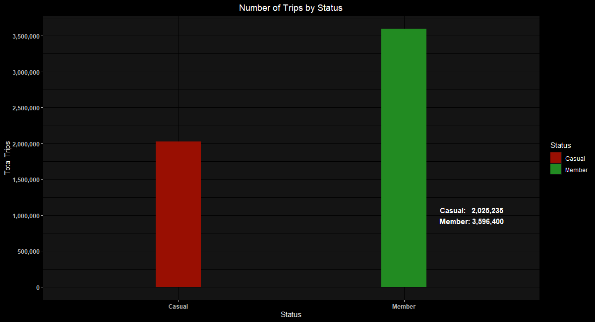
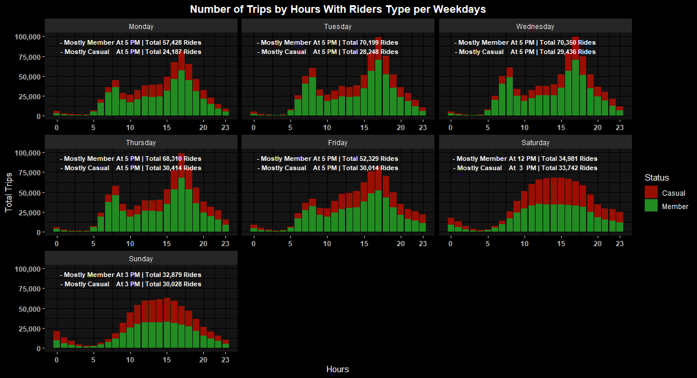
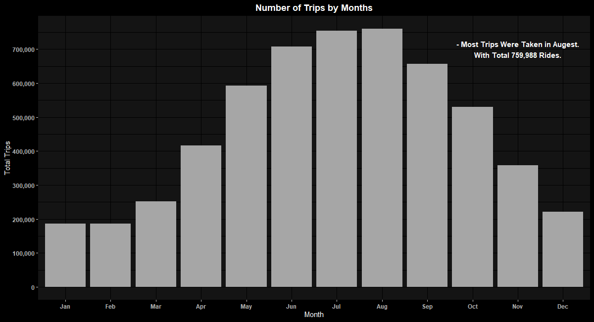
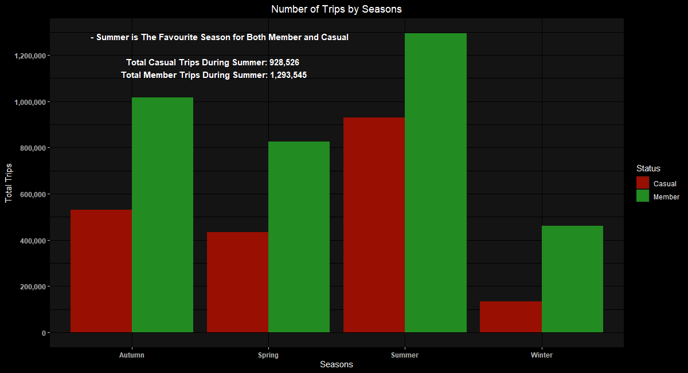
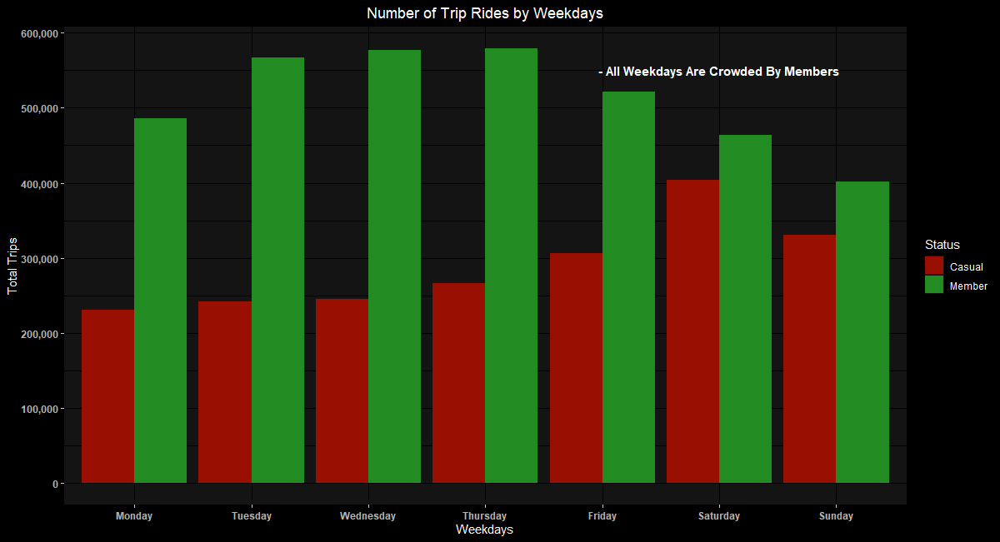
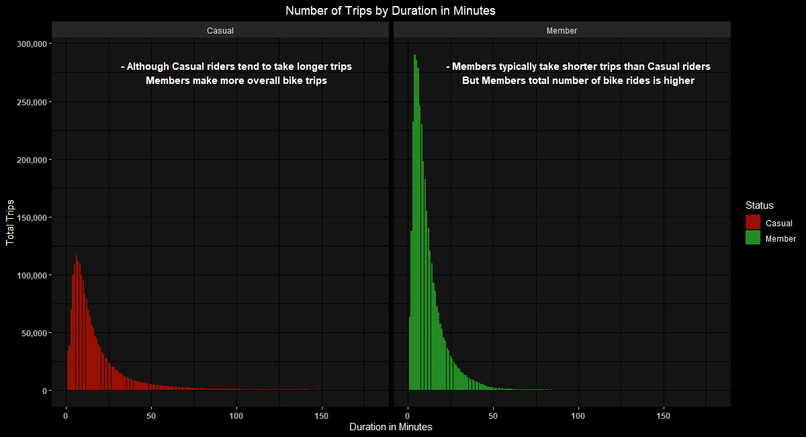
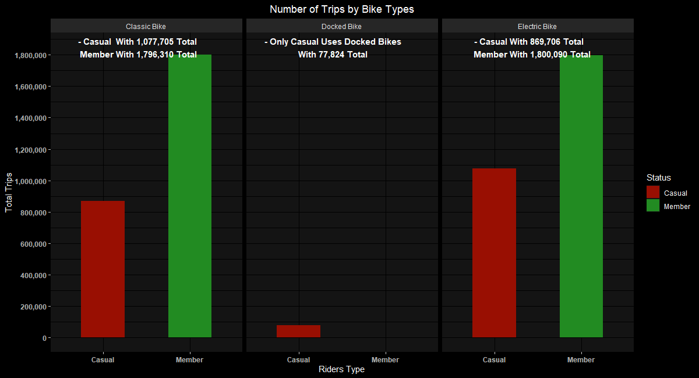

## Introduction

**Cyclistic** is a fictional company that has a bike share program and has many customers. The director of the marketing believes the comapany's future depends on maximizing certain types of customer. You, a part of the data analyst team, has been asked to answer few question. You'll be provided with a data source to not only answer these question, but aslo you'd be asked to share your insights and three top most recommendation on how to proceed with things.

> [!IMPORTANT]
> Codes? Check them out from here: [*Notebook codes*](./docs/)

> [!NOTE]
> For Source Codes check them from here: [*Source Codes*](./codes/)

## Background

* **Project Focus:** Analyzing user behavior and trends in the bike-sharing industry.

* **Initial Steps:** Conducted data gathering, cleaning, and exploratory analysis using R with RStudio.

* **Key Analysis:** Explored patterns in bike usage based on factors such as time of day, day of the week, month of the year, and weather conditions.

* **Utilization of Secondary Data:** Leveraged external datasets, including weather data and demographic information, to enrich the analysis and identify potential correlations and insights.

* **Outcome:** Honed analytical skills and provided actionable insights for optimizing services and targeting marketing strategies within the bike-sharing market.

## Tools

* [**R**](https://www.r-project.org/) 

  * **R** serves as our fundamental programming language, facilitates insightful exploration and interpretation of complex datasets. Supported by essential Libraries.
    
  * **Libraries:** [**Tidyverse**](https://www.tidyverse.org/) | [**Janitor**](https://www.rdocumentation.org/packages/janitor/versions/2.2.0) | [**Scales**](https://www.rdocumentation.org/packages/scales/versions/1.3.0)  | [**Knitr**](https://www.rdocumentation.org/packages/knitr/versions/1.46) |
[**Here**](https://www.rdocumentation.org/packages/here/versions/1.0.1)  |
[**ggdark**](https://www.rdocumentation.org/packages/ggdark/versions/0.2.1)
    * **Tidyverse:** Comprehensive toolkit for data science that integrates essential packages such as dplyr, ggplot2, tidyr, and readr. It promotes tidy data principles and enables streamlined, expressive workflows.
    
    * **Janitor:** Simplifies data cleaning tasks in R with intuitive functions for removing duplicate rows, columns, and empty cells, handling missing values, and generating frequency tables.
    
    * **Scales:** Facilitates data visualization in R by providing functions for scaling and transforming data, formatting axis labels, breaks, and scales, enhancing the customization and presentation of ggplot plots.
    
    * **Knitr:** Enables dynamic report generation in R by combining code, output, and narrative text in a single document, facilitating reproducible research and automated report generation workflows.
    
    * **Here:** Simplifies project directory management by providing a reliable way to construct file paths relative to the top-level project directory, ensuring reproducibility and portability across different environments.
    
    * **ggdark:** Enhances data visualization in R by providing a dark theme for ggplot2 plots, improving readability and aesthetics, especially in environments with low ambient light or for stylistic preferences.

* [**RStudio**](https://posit.co/products/open-source/rstudio/) 

  * **RStudio** as the primary integrated development environment (IDE) for R programming, offering features such as code editing, debugging, project management, version control integration, and interactive visualization, streamlining the development and analysis process.

* [**Git**](https://git-scm.com/)  **&** [**GitHub**](https://github.com/) 

* **Git** is utilized for version control and collaborative development, while **GitHub** serves as the repository hosting platform. These tools facilitate efficient team collaboration and ensure the integrity and traceability of project versions.

## Objectives

### 1) Packages
> [!TIP]
> Notebook Code: [**Importing Packages Code**](./docs/1_Importing_Packages.md)
> Code: [**Importing Packages Code**](./codes/1_Importing_Packages.Rmd)

### 2) Datasets
> [!TIP]
> Notebook Code: [**Importing Datasets Code**](./codes/2_Importing_Datasets.md)
Code: [**Importing Datasets Code**](./codes/2_Importing_Datasets.Rmd)

### 3) Data Preparation
> [!TIP]
> Notebook Code: [**Preparation Code**](./codes/3_Data_Preparation.md)
> Code: [**Preparation Code**](./codes/3_Data_Preparation.Rmd)

### 4) Data Exploration
> [!TIP]
> Notebook Code: [**Exploration Code**](./codes/4_Data_Exploration.md)
Code: [**Exploration Code**](./codes/4_Data_Exploration.Rmd)

### 5) Total Rides By Riders Status
> [!TIP]
> Notebook Code: [**Riders Status Code**](./codes/5_Total_Rides_By_Status.md)
> Code: [**Riders Status Code**](./codes/5_Total_Rides_By_Status.Rmd)

[**Riders Status Plot**](./assets/Status.png) 

### 6) Total Rides By Hours
> [!TIP]
> Notebook Code: [**Hours Code**](./codes/6_Total_Rides_By_Hours.md)
> Code: [**Hours Code**](./codes/6_Total_Rides_By_Hours.Rmd)

[**Hours Plot**](./assets/Hours.png) 

### 7) Total Rides By Months
> [!TIP]
> Notebook Code: [**Months Code**](./codes/7_Total_Rides_By_Months.md)
> Code: [**Months Code**](./codes/7_Total_Rides_By_Months.Rmd)

[**Months Plot**](./assets/Months.png) 

### 8) Total Rides By Seasons
> [!TIP]
> Notebook Code: [**Seasons Code**](./codes/8_Total_Rides_By_Seasons.md)
> Code: [**Seasons Code**](./codes/8_Total_Rides_By_Seasons.Rmd)

[**Seasons Plot**](./assets/Seasons.png) 

### 9) Total Rides By Weekdays
> [!TIP]
> Notebook Code: [**Weekdays Code**](./codes/9_Total_Rides_By_Weekdays.md)
> Code: [**Weekdays Code**](./codes/9_Total_Rides_By_Weekdays.Rmd)

[**Weekdays Plot**](./assets/Weekdays.png) 

### 10) Total Rides By Trips Duration
> [!TIP]
> Notebook Code: [**Duration Code**](./codes/10_Total_Rides_By_Duration.md)
> Code: [**Duration Code**](./codes/10_Total_Rides_By_Duration.Rmd)

[**Duration Plot**](./assets/Duration.png) 

### 11) Total Rides By Bike Types
> [!TIP]
> Notebook Code: [**Bike Types Code**](./codes/11_Total_Rides_By_Bike_Types.md)
> Code: [**Bike Types Code**](./codes/11_Total_Rides_By_Bike_Types.Rmd)

[**Bike Types Plot**](./assets/Types.png) 

## Resources
> [!NOTE]
> **Source:** [**Google Data Analytics Professional Certificate**](https://www.coursera.org/professional-certificates/google-data-analytics)