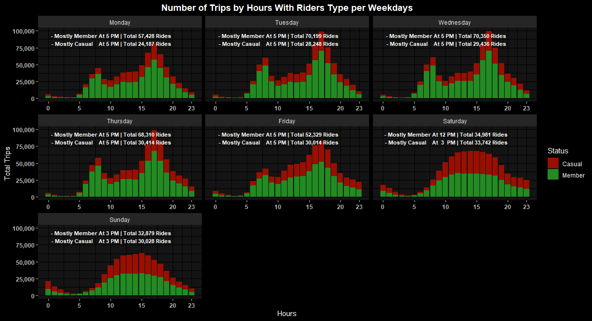
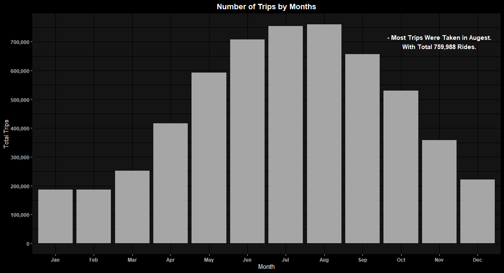
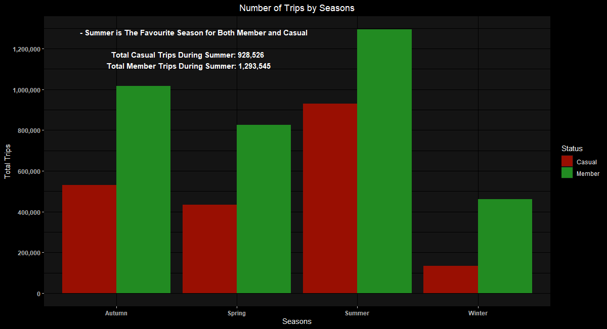
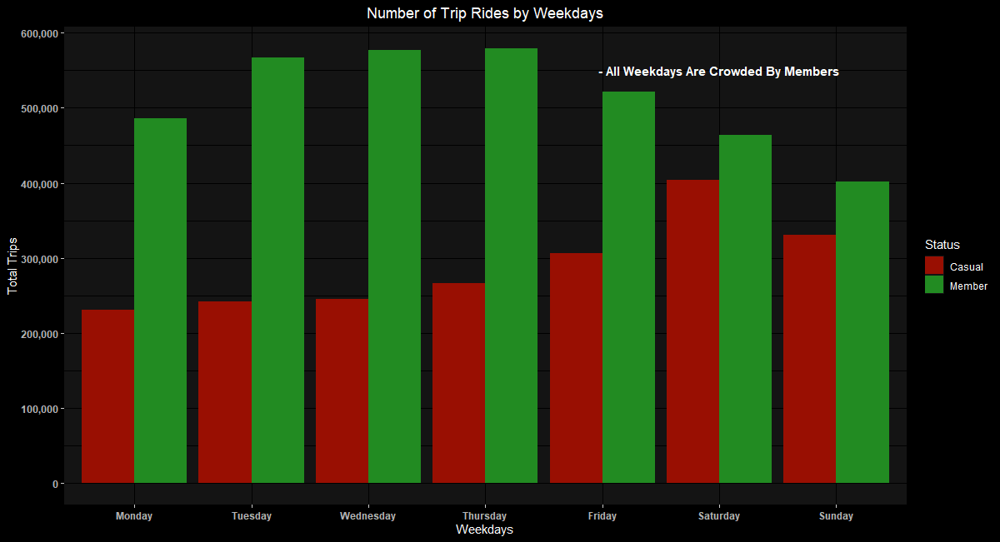

# <h1 align="center"> Cyclistic Bike-share Analysis Case Study

# Introduction

This case study is the [Capstone Project](https://www.coursera.org/learn/google-data-analytics-capstone) of [Google Data Analytics Professional Certificate](https://www.coursera.org/professional-certificates/google-data-analytics). In this case study I am working as a junior data analyst in the marketing analyst team at Cyclistic, a fictional bike-share company in Chicago.

**Cyclistic** is a bike-share program that features more than 5,800 bicycles and 600 docking stations. Cyclistic sets itself apart by also offering reclining bikes, hand tricycles, and cargo bikes, making bike-share more inclusive to people with disabilities and riders who can’t use a standard two-wheeled bike. The majority of riders opt for traditional bikes; about 8% of riders use the assistive options. Cyclistic users are more likely to ride for leisure, but about 30% use them to commute to work each day.

> [!IMPORTANT]
> Codes? Check them out from here: [*Notebook codes*](./docs/)

> [!NOTE]
> For Source Codes check them from here: [*Source Codes*](./codes/)

# Background

-   **Project Focus:** Analyzing user behavior and trends in the
    bike-sharing industry.

-   **Initial Steps:** Conducted data gathering, cleaning, and
    exploratory analysis using R with RStudio.

-   **Key Analysis:** Explored patterns in bike usage based on factors
    such as time of day, day of the week, month of the year, and weather
    conditions.

-   **Utilization of Secondary Data:** Leveraged external datasets,
    including weather data and demographic information, to enrich the
    analysis and identify potential correlations and insights.

-   **Outcome:** Honed analytical skills and provided actionable
    insights for optimizing services and targeting marketing strategies
    within the bike-sharing market.

# Tools

-   [**R**](https://www.r-project.org/) 

    -   **R** serves as our fundamental programming language,
        facilitates insightful exploration and interpretation of complex
        datasets. Supported by essential Libraries.

    -   **Libraries:** [**Tidyverse**](https://www.tidyverse.org/) \|
        [**Janitor**](https://www.rdocumentation.org/packages/janitor/versions/2.2.0)
        \|
        [**Scales**](https://www.rdocumentation.org/packages/scales/versions/1.3.0)
        \|
        [**Knitr**](https://www.rdocumentation.org/packages/knitr/versions/1.46)
        \|
        [**Here**](https://www.rdocumentation.org/packages/here/versions/1.0.1)
        \|
        [**ggdark**](https://www.rdocumentation.org/packages/ggdark/versions/0.2.1)

        -   **Tidyverse:** Comprehensive toolkit for data science that
            integrates essential packages such as dplyr, ggplot2, tidyr,
            and readr. It promotes tidy data principles and enables
            streamlined, expressive workflows.

        -   **Janitor:** Simplifies data cleaning tasks in R with
            intuitive functions for removing duplicate rows, columns,
            and empty cells, handling missing values, and generating
            frequency tables.

        -   **Scales:** Facilitates data visualization in R by providing
            functions for scaling and transforming data, formatting axis
            labels, breaks, and scales, enhancing the customization and
            presentation of ggplot plots.

        -   **Knitr:** Enables dynamic report generation in R by
            combining code, output, and narrative text in a single
            document, facilitating reproducible research and automated
            report generation workflows.

        -   **Here:** Simplifies project directory management by
            providing a reliable way to construct file paths relative to
            the top-level project directory, ensuring reproducibility
            and portability across different environments.

        -   **ggdark:** Enhances data visualization in R by providing a
            dark theme for ggplot2 plots, improving readability and
            aesthetics, especially in environments with low ambient
            light or for stylistic preferences.

-   [**RStudio**](https://posit.co/products/open-source/rstudio/)
    

    -   **RStudio** as the primary integrated development environment
        (IDE) for R programming, offering features such as code editing,
        debugging, project management, version control integration, and
        interactive visualization, streamlining the development and
        analysis process.

-   [**Git**](https://git-scm.com/)  **&**
    [**GitHub**](https://github.com/) 

-   **Git** is utilized for version control and collaborative
    development, while **GitHub** serves as the repository hosting
    platform. These tools facilitate efficient team collaboration and
    ensure the integrity and traceability of project versions.

# Objectives

## 1) Packages
> [!TIP]
> Notebook Code: [**Importing Packages Code**](./docs/1_Importing_Packages.md)
> 
> Code: [**Importing Packages Code**](./codes/1_Importing_Packages.Rmd)

## 2) Datasets
> [!TIP]
> Notebook Code: [**Importing Datasets Code**](./codes/2_Importing_Datasets.md)
> 
> Code: [**Importing Datasets Code**](./codes/2_Importing_Datasets.Rmd)

## 3) Data Preparation
> [!TIP]
> Notebook Code: [**Preparation Code**](./codes/3_Data_Preparation.md)
> 
> Code: [**Preparation Code**](./codes/3_Data_Preparation.Rmd)

## 4) Data Exploration
> [!TIP]
> Notebook Code: [**Exploration Code**](./codes/4_Data_Exploration.md)
> 
> Code: [**Exploration Code**](./codes/4_Data_Exploration.Rmd)

## 5) Total Rides By Riders Status
> [!TIP]
> Notebook Code: [**Riders Status Code**](./codes/5_Total_Rides_By_Status.md)
> 
> Code: [**Riders Status Code**](./codes/5_Total_Rides_By_Status.Rmd)

[**Riders Status Plot**](./assets/Status.png) 

## 6) Total Rides By Hours
> [!TIP]
> Notebook Code: [**Hours Code**](./codes/6_Total_Rides_By_Hours.md)
> 
> Code: [**Hours Code**](./codes/6_Total_Rides_By_Hours.Rmd)

[**Hours Plot**](./assets/Hours.png) 

## 7) Total Rides By Months
> [!TIP]
> Notebook Code: [**Months Code**](./codes/7_Total_Rides_By_Months.md)
> 
> Code: [**Months Code**](./codes/7_Total_Rides_By_Months.Rmd)

[**Months Plot**](./assets/Months.png) 

## 8) Total Rides By Seasons
> [!TIP]
> Notebook Code: [**Seasons Code**](./codes/8_Total_Rides_By_Seasons.md)
> 
> Code: [**Seasons Code**](./codes/8_Total_Rides_By_Seasons.Rmd)

[**Seasons Plot**](./assets/Seasons.png) 

## 9) Total Rides By Weekdays
> [!TIP]
> Notebook Code: [**Weekdays Code**](./codes/9_Total_Rides_By_Weekdays.md)
> 
> Code: [**Weekdays Code**](./codes/9_Total_Rides_By_Weekdays.Rmd)

[**Weekdays Plot**](./assets/Weekdays.png) 

## 10) Total Rides By Trips Duration
> [!TIP]
> Notebook Code: [**Duration Code**](./codes/10_Total_Rides_By_Duration.md)
> 
> Code: [**Duration Code**](./codes/10_Total_Rides_By_Duration.Rmd)

[**Duration Plot**](./assets/Duration.png) 

## 11) Total Rides By Bike Types
> [!TIP]
> Notebook Code: [**Bike Types Code**](./codes/11_Total_Rides_By_Bike_Types.md)
> 
> Code: [**Bike Types Code**](./codes/11_Total_Rides_By_Bike_Types.Rmd)

[**Bike Types Plot**](./assets/Types.png) 

# Resources
> [!NOTE]
> **Source:** [**Google Data Analytics Professional Certificate**](https://www.coursera.org/professional-certificates/google-data-analytics)
